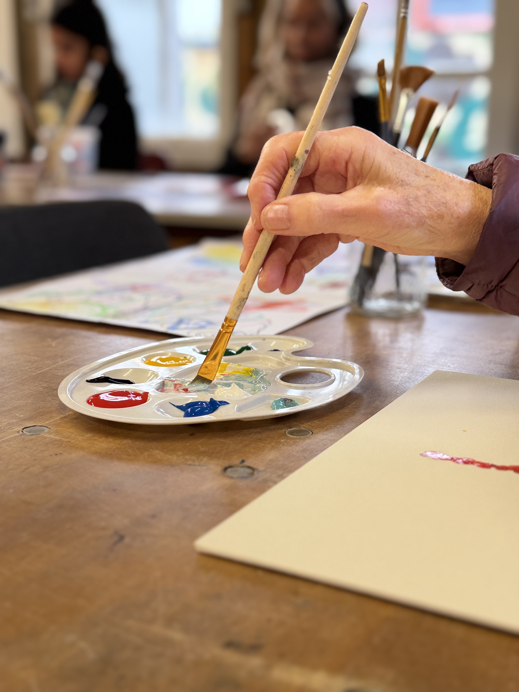
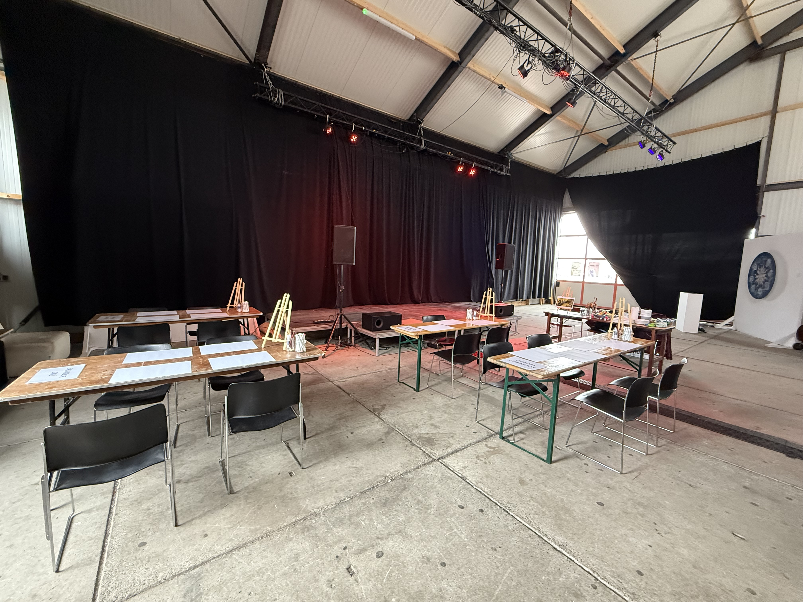
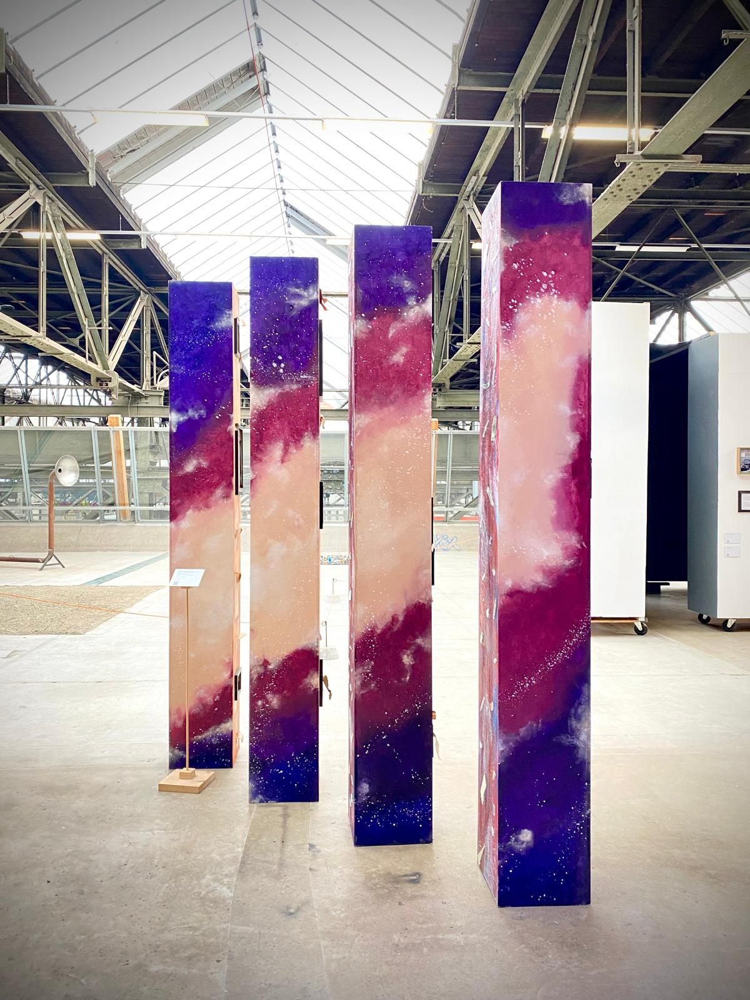
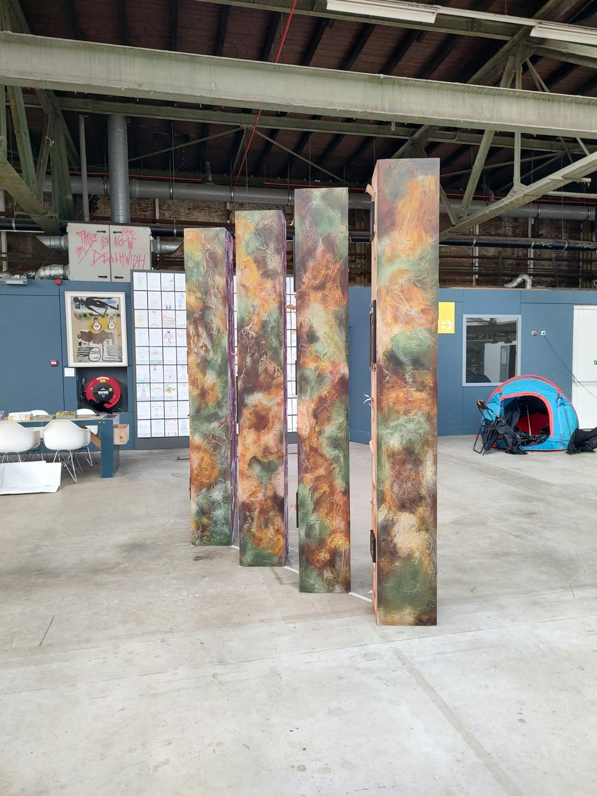
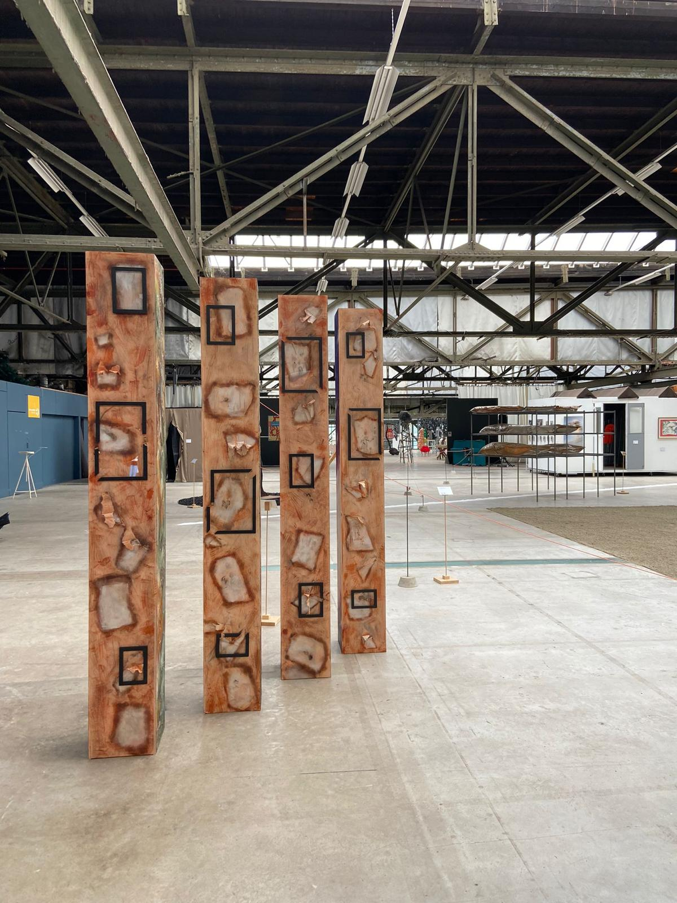
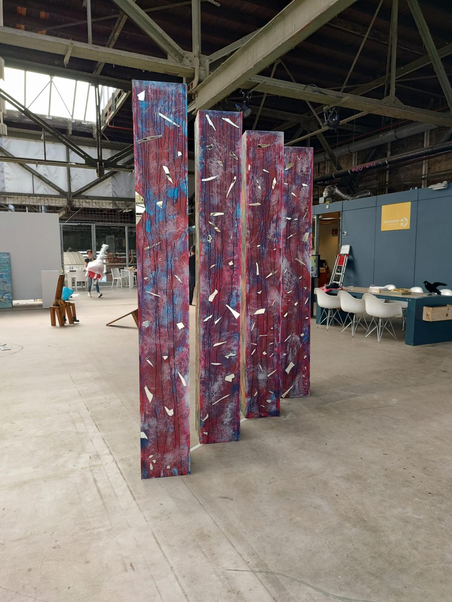
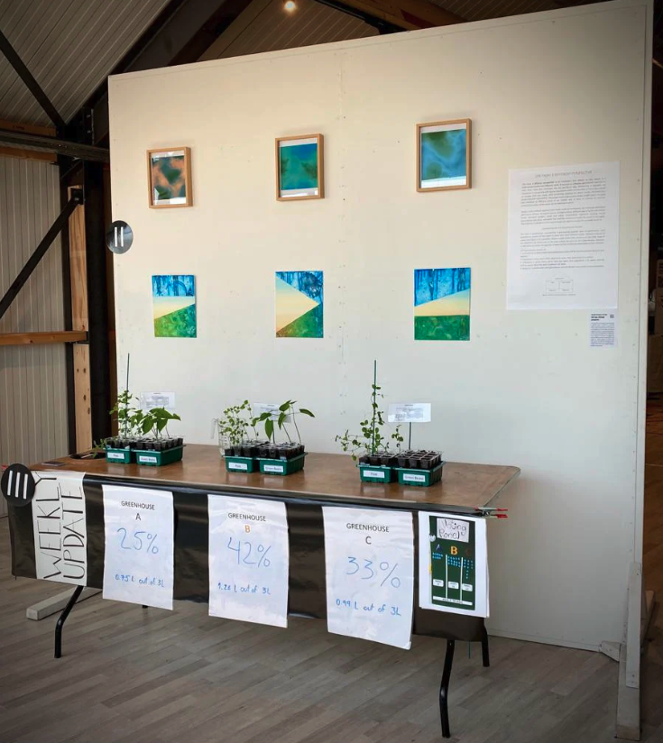

I am deeply interested in art and regularly collaborate with professionals across fields to create projects and events that bring science and art together.

#### V.O.W: Voices of Women (2025–now)
------
[V.O.W: Voices of Women](https://marcelaperrusquia.com/pages/vow) is a project grounded in sisterhood, defiance, and collective action. Through art and storytelling, it challenges oppressive systems and centers women’s lived experiences as sources of knowledge, power, and resistance. Across the world, women continue to face systemic barriers: restricted opportunities, political and social suppression, and gender-based violence, including femicide. Yet women persist. They organize, protest, create, and build communities of care and opposition. V.O.W investigates how women’s voices, bodies, and actions become catalysts for resilience and change. It stands as a testament to those who refuse to be silenced and as a call to witness, remember, and act.

- Credits & collaborators: project artist / author - [Marcela Perrusquía](https://marcelaperrusquia.com/blogs/news/about) (led all stages of the project, including the residency, interviews, storytelling, writing, artwork production, installation, and exhibition); research support: Ana da Silva Pinho (research, translation, writing, and installation support). With the participation of [María Elena Ríos](https://es.wikipedia.org/wiki/Mar%C3%ADa_Elena_R%C3%ADos) (activist and musician) and [Mahé Elipe](https://www.mahelipe.com/bio-contact) (photojournalist).

#### HerArt (2024-now) 
------
The [HerArt workshop series](https://marcelaperrusquia.com/pages/workshops-herart-series) highlights the often-overlooked contributions of women artists throughout art history. Because women remain underrepresented in mainstream art narratives and museum collections, each session combines an art history lesson and artistic context with hands-on, and artist-inspired painting activities. Participants explore the techniques, themes, and visual language of selected artists through guided group exercises and by creating their own artwork. Since 2024, three editions have taken place, with 170+ participants attending. Also, all editions adhered to the [stadpas](https://www.amsterdam.nl/stadspas/) initiative, making attandance more accessible to everyone. 

- Visual artist and art educator (project author & workshop lead): [Marcela Perrusquía](https://marcelaperrusquia.com/blogs/news/about)
- My contribution: content development support, planning, participant communication and coordination, and photography

[repository](https://osf.io/b9d6t/files/osfstorage)

  <a href="../assets/images/paletet.jpg" target="_blank" rel="noopener">
    

      
    

  </a>

  <a href="../assets/images/frida.jpg" target="_blank" rel="noopener">
    

      
    

  </a>

  <a href="../assets/images/room.jpg" target="_blank" rel="noopener">
    

      
    

  </a>

#### Breaking boundaries (2023-2024) 
------

**[Breaking boundaries](https://breakingboundaries.myportfolio.com/)** was part of the exhibition NDSM Fuse Xpo XIV: Op de Vlucht (On The Run); 1 September 2023 - 10 March 2024 NDSM-Plein 29, Amsterdam (NL) [NDSMFuse.eu](https://www.ndsm-fuse.eu/)

Border walls symbolize a world where refugees are unwelcome. As people seek safety in a new land, they often encounter barbed wire and severe hostility, reflecting the adverse attitudes towards them across the globe. Inspired by the interactive murals at the Tijuana-San Diego border wall, Breaking Boundaries presents a stark contrast between both sides of a border wall. On one side lies the homeland, where memories coexist with the violence of escaping. On the other side stands the new land offering safety, yet shadowed by discrimination.  Breaking Boundaries seeks to evoke the experience of a new beginning, where unity and empathy transcends the barriers of the border-walled world today.

Project developed in collaboration with visual artist and art educator [Marcela Perrusquía](https://marcelaperrusquia.com/blogs/news/about) and photographer and project manager Arts & Culture, City of Amsterdam [Benny van der Plank](https://bennyvanderplank.com/about-1).

- My contribution: from conceptualization to exhibition

Exhibition curator: [Ellen Klijzing](https://www.ellenklijzing.nl/)

[repository of the project](https://osf.io/b9d6t/overview)

- Breaking boundaries at minute 7:02 and in [Het Parool](https://osf.io/b9d6t/files/gh9dy) 
<iframe width="560" height="315" src="https://www.youtube.com/embed/ry2OUpIi2OU?si=G_Zb5MtRK4XCEE-H" title="YouTube video player" frameborder="0" allow="accelerometer; autoplay; clipboard-write; encrypted-media; gyroscope; picture-in-picture; web-share" referrerpolicy="strict-origin-when-cross-origin" allowfullscreen></iframe> 

 

  <a href="../assets/images/dream.jpeg" target="_blank" rel="noopener" style="flex:0 0 auto;">
    

      
    

  </a>

  <a href="../assets/images/military.jpeg" target="_blank" rel="noopener" style="flex:0 0 auto;">
    

      
    

  </a>

  <a href="../assets/images/memory.jpeg" target="_blank" rel="noopener" style="flex:0 0 auto;">
    

      
    

  </a>

  <a href="../assets/images/clown.jpeg" target="_blank" rel="noopener" style="flex:0 0 auto;">
    

      
    

  </a>

#### Life from a different perspective (2023) 
------

The installation **[Life from a different perspective](https://osf.io/b9d6t/files/4uhkv)** was selected to be part of the ['Hear all Voices' exhibition](https://www.treehousendsm.com/agenda/hear-all-voices) that took place at Treehouse, NDSM, June and July 2023, supported by AFK (Amsterdams Fonds voor de Kunst).

This project reflects on how people in a multicultural society have different needs. It focuses on a flexible and inclusive approach to meet these needs and challenges
the one-size-fits-all idea. It highlights the importance of recognizing and valuing singularities within communities. It encourages people to consider their own needs, while
promoting empathy for others’ needs, and fostering a sense of shared responsibility. The project seeks to generate a deeper insight about the space and relevance of different voices
in our society, and of ways of creating an inclusive environment where these voices can be heard and coexist.

Using a multi-method approach and mixed-media art techniques, we prototyped alternative governance systems. The concept draws on an analogy where different types of seeds - each
with distinct needs - represent diverse people and their voices. Greenhouses symbolize societies in which governance occurs, while water represents the resources available to
address these needs. Viewers were invited to decide which greenhouse should receive the available water.

Project developed in collabroation with visual artist and art educator [Marcela Perrusquía](https://marcelaperrusquia.com/blogs/news/about).

- My contribution: from conceptualization to exhibition

- _Depiction of the installation_

  <a href="../assets/images/part1.png" target="_blank" rel="noopener"
     style="flex:0 0 auto; text-decoration:none;">
    

      
    

  </a>

  <a href="../assets/images/part2.png" target="_blank" rel="noopener"
     style="flex:0 0 auto; text-decoration:none;">
    

      
    

  </a>

#### 3DISCO: 3D imaging of solvent-cleared organs (2019) 
----

Image submitted to Art of Neuroscience an initiative of the Royal Netherlands Academy of Arts and Sciences (KNAW), which was selected for presentation at the ECNP Congress 2019 (7–10 September), Copenhagen, Denmark. The selected artworks were displayed on screen in a dedicated congress space and featured as part of the session _“The beauty of the brain: a journey in pictures”_, which included a discussion on the intersection of neuroscience, imagery, and public engagement.

In collabroation with developmental neurobiologist Özge Düdükcü. 

- My contribution: digital post-processing and editing

<a href="/assets/images/3disco.pdf" target="_blank" rel="noopener">
  Open the PDF to see the artwork
</a>

